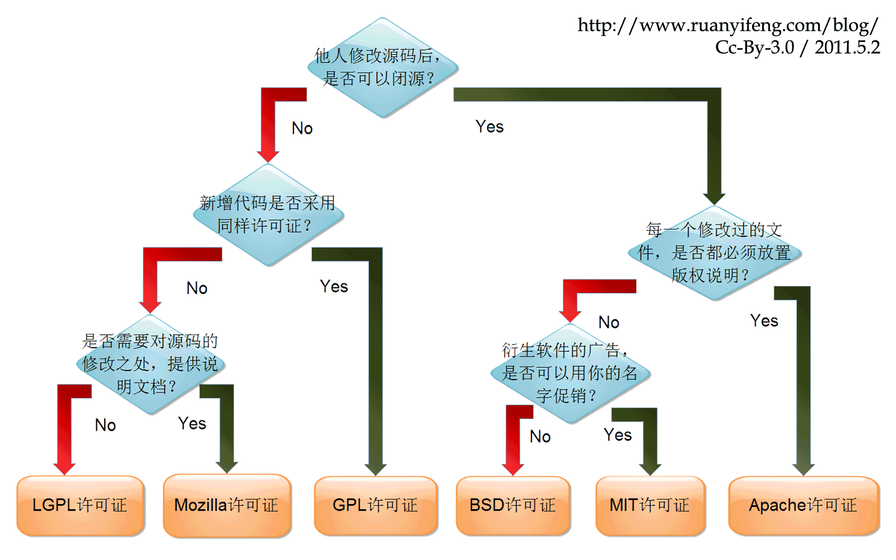

#### Open Source License Table

常用种类 | 特点
------- | ----
GPL     |1.他人修改源码后不可以闭源；2.新增代码后采用同样的许可证。
LGPL    |1.他人修改源码后不可以闭源；2.新增代码可以不采用同样的许可证；3.对源码的修改之处可以不提供说明文档。
Mozilla |1.他人修改源码后不可以闭源；2.新增代码可以不采用同样的许可证；3.对源码的修改之处需要提供说明文档。
BSD     |1.他人修改源码后可以闭源；2.每一个修改后的文件可以不放置版权说明；3.衍生软件的广告不可以使用你的名字促销。
MIT     |1.他人修改源码后可以闭源；2.每一个修改后的文件可以不放置版权说明；3.衍生软件的广告可以使用你的名字促销。
Apache  |1.他人修改源码后可以闭源；2.每一个修改后的文件都必须放置版权说明。

#### 图示说明

